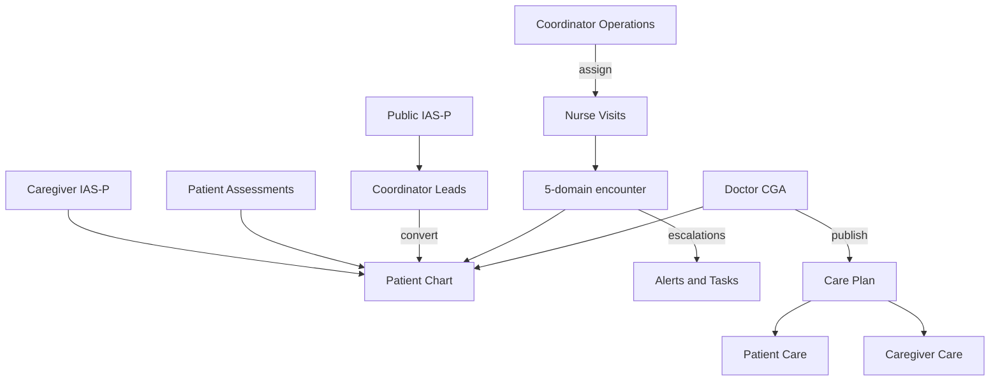

# Nivarak Frontend Architecture

> **Status:** Auth + app shell in progress · remaining modules planned against confirmed IA  
> **Canonical IA:** Phase 1–3 audit (confirmed) — ~80 screens, 28 shared assets  
> **Location:** `client/` (Next.js App Router)

---

## 1. Product & stack

Nivarak is an eldercare platform: families assess independence (IAS-P), nurses capture 5-domain encounters, doctors run CGA/BGS, coordinators own schedule and escalations.

| Layer | Choice |
| ----- | ------ |
| App | Next.js 16 (App Router) · React 19 · TypeScript |
| Styling | Tailwind CSS 4 · CSS variables in `globals.css` |
| UI primitives | shadcn/ui (Radix Vega) |
| Icons | Hugeicons (`@hugeicons/react`) |
| Motion | Framer Motion |
| Forms | React Hook Form + Zod |
| Server state | TanStack Query *(installed, not wired yet)* |
| Client state | Zustand *(installed, not wired yet)* |
| Toasts | Sonner |
| Font | Hanken Grotesk |
| Identity | AWS Cognito (sign-up / sign-in / OTP / password) — **not wired** |
| API | Hono modular monolith at `/api/v1` (`NEXT_PUBLIC_API_URL`, default `http://localhost:3000`) |

**Roles (highest privilege first):** `admin` → `coordinator` → `doctor` → `nurse` → `caregiver` → `patient`

---

## 2. Repo hierarchy

```
Nivarak/
├── client/                    # Frontend (this document)
├── server/                    # Hono API + Drizzle
└── drizzle/                   # SQL migrations
```

### 2.1 Client (as built)

```
client/
├── app/
│   ├── layout.tsx             # Root: Hanken Grotesk, globals.css
│   ├── page.tsx               # Marketing landing → /login | /register
│   ├── globals.css            # Design tokens as CSS variables
│   ├── (auth)/
│   │   ├── layout.tsx         # Split AuthLayout (hero + card)
│   │   ├── login/page.tsx
│   │   ├── register/page.tsx
│   │   ├── forgot-password/page.tsx
│   │   └── invite/accept/page.tsx
│   ├── dashboard/page.tsx     # Stub (signed-in placeholder)
│   ├── protected/
│   │   └── layout.tsx         # Sidebar + main canvas
│   └── dev/                   # Local OTP preview screens (not product)
│       ├── otp/page.tsx
│       └── forgot-otp/page.tsx
├── components/
│   ├── ui/                    # shadcn primitives
│   ├── auth/                  # Unified auth module (built)
│   └── layout/
│       └── sidebar.tsx        # Prototype Patient-style nav
├── lib/
│   ├── api.ts                 # fetch wrapper + ApiError envelope
│   ├── auth.ts                # access/refresh tokens in localStorage
│   ├── utils.ts               # cn()
│   └── auth/                  # roles, password Zod, typography, phone codes, assets
├── types/
│   └── auth.ts
├── public/images/
├── components.json            # shadcn config
└── package.json
```

### 2.2 Target client layout (feature-first)

Keep `app/` thin (routes + layouts only). Put domain UI under `components/` and `features/`. Do **not** recreate the old `web/` tree.

```
client/src-equivalent (current roots: app/, components/, lib/, types/)
├── app/
│   ├── (auth)/ …              # already exists
│   ├── (public)/
│   │   └── assess/            # Public IAS-P landing + wizard
│   └── (protected)/           # Role-conditional AppLayout
│       ├── dashboard/
│       ├── patients/          # Roster (caregiver / clinician / admin modes)
│       ├── care/              # Care Hub tabs
│       ├── health/            # Assessments | Vitals | Health record
│       ├── care-team/
│       ├── alerts/
│       ├── visits/            # Nurse queue → encounter wizard
│       ├── cga/               # Doctor CGA list + workspace
│       ├── schedule/          # Coordinator org calendar | Doctor My Schedule
│       ├── operations/        # Coordinator tasks board
│       ├── leads/
│       ├── staff/
│       ├── admin/
│       └── settings/
├── components/
│   ├── ui/                    # shadcn only
│   ├── auth/                  # keep as-is
│   ├── layout/                # Sidebar, header, page chrome, bottom nav
│   └── shared/                # Roster, Chart, badges, empty/error, wizard chrome
├── features/                  # One folder per domain (patients, scoring, encounters, …)
├── hooks/                     # TanStack Query hooks per domain
├── stores/                    # Zustand: auth, ui, selected-elder
├── services/                  # Thin API modules over lib/api.ts
└── types/                     # Mirror backend entities
```

---

## 3. Confirmed product IA (lock)

These decisions replace the old HLD “one clinician portal + 24 pages” map.

| Decision | Resolution |
| -------- | ---------- |
| Patient vs Caregiver | **Two modules**, not one Family app. Share components; do not share shells. |
| Nurse vs Doctor | **Clinician shared shell** (Roster, Chart, Alerts, Settings). Different primary nav. |
| Encounter domains | **5** (Medical & Medicines, Mobility, Social, Nutritional, Cognitive). Psychological/Mood is CGA-only. |
| Nurse Encounters nav | **Removed.** Encounter opens from a Visit. |
| Insights | **Removed.** Replaced by Alerts / Alerts & Tasks / Home widgets. |
| Auth chrome | **One unified Split login** for every role. No `admin.*` / `care.*` subdomains. |
| Visits vs encounters | Backend resource is **encounters**. UI “Visits” = work queue; capture = encounter wizard. |

### 3.1 Instruments (do not collapse in UI)

| Instrument | Who | Where in UI | Output |
| ---------- | --- | ----------- | ------ |
| **IAS-P v2.0** | Patient self, caregiver proxy, public lead | Health → Assessments; Caregiver action; `/assess`; Coordinator Leads | Score /48, 5 risk bands, 8 red flags, pathway |
| **5-domain encounter** | Nurse (full); caregiver `carer_report` (quick-status) | Nurse Visits wizard; Caregiver Report an update | Locked longitudinal record + escalations |
| **CGA/BGS** | Doctor | CGA Assessments workspace | Problem list, care plan, sign-off |



### 3.2 Sidebars by role

**Patient** — Home · Care (Plan / Meds / Tasks / Appointments tabs) · Health (IAS-P / Vitals / Health record) · Care Team · Settings

**Caregiver** (≤5 mobile roots) — Patients · Home · Care (same tabs, consent-scoped) · Alerts · Settings · *(IAS-P + Carer Report = actions, not extra roots)*

**Coordinator** — Home · Leads · Patients · Operations (Schedule · Tasks) · Staff · Alerts & Tasks · Settings

**Nurse** — Visits (Home merged into Today) · Patients · Alerts · Settings · *(Amend = action)*

**Doctor** — Home · Patients · CGA Assessments · My Schedule · Alerts · Settings

**Admin** — Home · Users & access · Organizations · Patients (lookup) · Configuration (IAS Scoring · Alert Rules · Integrations) · Settings

**Do not design:** Nurse Encounters root · Insights · family Care Plan / formulary editors · 19 CGA pages · 5 unique domain UIs · Doctor org-schedule twin · Admin Roles/Permissions as sibling roots · manual cross-domain flag editor

---

## 4. Routes

### 4.1 Implemented

| Route | Layout | Notes |
| ----- | ------ | ----- |
| `/` | Bare | Landing CTAs |
| `/login` | AuthLayout | Phone OTP (default) + email/password switch |
| `/register` | AuthLayout | Phone OTP → complete profile |
| `/forgot-password` | AuthLayout | Email → OTP → reset |
| `/invite/accept` | AuthLayout | Register with `?phone=` |
| `/dashboard` | Bare stub | Not inside protected layout |
| `/protected/*` | AppLayout (sidebar) | Layout only; child pages not built |
| `/dev/otp`, `/dev/forgot-otp` | AuthLayout | Dev previews |

Auth screens share one `AuthScreen` driven by `mode: 'login' \| 'register' \| 'forgot-password'`. Cognito calls throw `501` until wired.

### 4.2 Target authenticated map

Use the `(protected)` group. Sidebar items are **role-filtered**; same route can render role-specific pages (e.g. Home).

| Route | Screen IDs | Roles |
| ----- | ---------- | ----- |
| `/protected/dashboard` | P-01, CG-02, CC-01, D-01, AD-01 | All (content by role). Nurse uses Visits as home. |
| `/protected/patients` | CG-01, CC-05, N-11, D-02, AD-07 | Caregiver+ |
| `/protected/patients/[id]` | CC-06, N-12a, D-03…D-07 | Chart shell, permissioned tabs |
| `/protected/care` | P-02…P-08, CG-03…CG-05 | Patient, Caregiver |
| `/protected/health` | P-09…P-13 | Patient (Caregiver via actions) |
| `/protected/health/assessments` | P-10, A-05, A-06 | Patient |
| `/protected/care-team` | P-14, P-15 | Patient |
| `/protected/alerts` | CG-06/07, N-12b, D-11b, CC-12 | Caregiver, Nurse, Doctor, Coordinator |
| `/protected/visits` | N-01…N-08 | Nurse |
| `/protected/visits/[visitId]` | N-02…N-07 | Nurse encounter spine |
| `/protected/cga` | D-08…D-10 | Doctor |
| `/protected/schedule` | CC-07…CC-09, D-11a | Coordinator org vs Doctor personal |
| `/protected/operations/tasks` | CC-10 | Coordinator |
| `/protected/leads` | CC-02…CC-04 | Coordinator |
| `/protected/staff` | CC-11 | Coordinator |
| `/protected/admin/users` | AD-02…AD-04 | Admin |
| `/protected/admin/organizations` | AD-05, AD-06 | Admin |
| `/protected/admin/config` | AD-08, AD-09 | Admin |
| `/protected/settings` | All `*-Settings` | All |
| `/assess` | A-04…A-06 | Public |

Post-login landing is `/protected/dashboard` for every role (`getHomeUrlForRoles`). Nurse Home is the Visits Today view at `/protected/visits`.

---

## 5. Layouts

| Layout | Used by | Chrome |
| ------ | ------- | ------ |
| **AuthLayout** | `(auth)` + public assess entry | Split: photo panel + auth card. No sidebar. Same chrome for every role. |
| **PublicLayout** | `/assess` wizard/results | Minimal header (logo). Centered wizard. |
| **AppLayout** | `(protected)` | Sidebar + main canvas. Mobile: drawer → **bottom nav** (4–5 items). |

### 5.1 Responsive nav

| Breakpoint | Nav |
| ---------- | --- |
| Desktop | Expanded sidebar |
| Tablet | Collapsed icon sidebar |
| Mobile | Hidden sidebar; bottom nav. Caregiver cap **≤5** roots. |

### 5.2 Auth flow (unified)


```mermaid
flowchart TD
  Open[/login] --> Method{Phone or Email}
  Method -->|Phone| OTP[Send + verify OTP]
  Method -->|Email| Pass[Email + password]
  Pass -->|Forgot| FP[/forgot-password]
  FP --> EmailOTP[Email OTP] --> Reset[New password]
  OTP --> Home[/protected/dashboard]
  Pass --> Home
  Register[/register] --> RegOTP[Phone OTP] --> Profile[Complete profile] --> Home
  Invite[/invite/accept] --> Profile
```


Identity is Cognito. App API only exposes `POST /auth/logout` and `POST /auth/invite` (admin/coordinator). Tokens today: `localStorage` keys `nivarak_access_token` / `nivarak_refresh_token` — replace with Cognito session when wired.

---

## 6. Screen inventory (80)

Full field-level inventory lives in the IA audit. Frontend counts **one wizard type**, not one Figma page per step.

| Module               | Count | IDs                                                                                                            |
| -------------------- | ----- | -------------------------------------------------------------------------------------------------------------- |
| Shared Auth / Public | 6     | A-01…A-06 — **implemented as one AuthScreen** (login / register / forgot collapsed) + public IAS-P still to build |
| Patient              | 16    | P-01…P-16                                                                                                      |
| Caregiver            | 12    | CG-01…CG-12                                                                                                    |
| Coordinator          | 14    | CC-01…CC-14                                                                                                    |
| Nurse                | 12    | N-01…N-11 + N-12a/b/c                                                                                          |
| Doctor               | 11    | D-01…D-10 + D-11a/b/c                                                                                          |
| Admin                | 9     | AD-01…AD-08 + AD-09a/b/c                                                                                       |

### 6.1 Shared assets (build once)

OTP pattern · IAS-P Wizard + Results · Patient Roster · Patient Chart · Care Hub + viewers · Care Plan Editor (doctor write) · Med list · Task checklist · Appointments + book visit · Assign clinician modal · Vitals capture/history · Health record + Document viewer · Alerts inbox + detail drawer · Domain Capture (×5 by config) · Encounter viewer + Amend · Flag Concern sheet · Task board · Settings pattern · Invite modals · Risk-band display · Wizard progress · Empty/error/offline states

---

## 7. Built vs planned

### Built

| Area | What exists |
| ---- | ----------- |
| Theme | `globals.css` CSS variables + Tailwind theme |
| Auth UI | Split layout, hero slideshow, login/register/forgot/invite, OTP, phone field, password strength, Framer transitions |
| App shell | Protected layout + collapsible sidebar (Patient-like items; not yet role-conditional) |
| API client | `apiFetch` + `{ success, data, error }` envelope |
| Roles helper | `lib/auth/roles.ts` |
| shadcn | button, input, label, card, badge, dialog, sheet, dropdown-menu, tooltip, separator, spinner, sonner |

### Not built

TanStack Query providers/hooks · Zustand stores · Cognito · route guards · all clinical/family pages · public `/assess` · role-aware sidebar · header/bottom nav · charts · data tables

Sidebar hrefs (`/protected/health/risk`, etc.) are placeholders and should be renamed to match §4.2 (Assessments, not “Risk Status”).

---

## 8. Feature → API mapping

Base URL: `{NEXT_PUBLIC_API_URL}/api/v1`

Envelope: `{ success, data, error: { code, message } }`

ABAC: every `/patients/:id/*` call is bound to the selected patient. Caregiver context switch must never send a raw `patientId` the client “picked” without server check.

| Feature | Frontend | APIs |
| ------- | -------- | ---- |
| Auth (Cognito) | `features/auth` | Cognito Hosted/SDK. App: `POST /auth/logout`, `POST /auth/invite` |
| Patients | Roster + Chart | `GET/POST /patients`, `GET/PUT /patients/:id`, `GET /patients/:id/summary`, caregivers CRUD |
| Encounters / Visits UI | Nurse wizard, Carer Report, Amend | `GET/POST /patients/:id/encounters`, `GET …/:encounterId`, `POST …/complete`, `POST …/amend` |
| Vitals | Health + Chart | `GET/POST /patients/:id/vitals`, `GET …/latest`, `GET …/trends`, `DELETE …/:vitalId` |
| IAS-P | Wizard + history + leads | Public `POST /scores/calculate`; `POST/GET /patients/:id/scores`, `GET …/latest`, `GET …/:scoreId` |
| Tasks | Care tabs + Coordinator board | `GET/POST /tasks`, `GET /tasks/:id`, `POST …/assign\|complete\|escalate\|cancel` |
| Alerts | Inbox + rules | `GET /alerts`, `GET /alerts/:id`, `POST …/acknowledge\|resolve`; `GET /patients/:id/alerts`; `GET/POST /patients/:id/alert-rules` |
| Documents | Health record | `POST /patients/:id/documents/upload-url`, `POST/GET /patients/:id/documents`, `GET …/:docId`, `GET …/:docId/url`, `DELETE …/:docId` |
| Dashboard | Role Home | `GET /dashboard/coordinator\|doctor\|caregiver\|admin` |
| Notifications | Bell (later) | `GET /notifications`, `PUT /notifications/:id/read`, `PUT /notifications/read-all` |
| Audit | Admin (IA gap — add under Admin) | `GET /audit-logs` |

**Still missing on API (UI planned):** CGA records, org schedule/visits queue distinct from encounters, leads conversion, care-plan resource, organizations, IAS config, staff directory. Chart/Care Plan/CGA screens should not invent REST shapes — add server modules first or stub with typed mocks.

---

## 9. State management

| Category | Tool | Contents | Persistence |
| -------- | ---- | -------- | ----------- |
| Auth session | Cognito SDK + thin Zustand | User, roles, tokens | Cognito; do not keep refresh tokens in `localStorage` long-term |
| UI | Zustand `useUIStore` | Sidebar collapsed, theme, mobile nav | localStorage |
| Selected elder | Zustand (Caregiver) | `patientId` for CG context | sessionStorage |
| Server data | TanStack Query | Patients, encounters, vitals, scores, tasks, alerts, dashboard | Memory cache |
| Forms | RHF + Zod | Auth, IAS-P, encounter domains, CGA, invites | Encounter drafts: **encrypted local store** (Nurse offline) |
| URL | searchParams | Tabs, pagination, filters, selected chart tab | URL |

### Query keys (target)

```ts
export const queryKeys = {
  patients: {
    all: ['patients'] as const,
    list: (filters: unknown) => ['patients', 'list', filters] as const,
    detail: (id: string) => ['patients', id] as const,
    summary: (id: string) => ['patients', id, 'summary'] as const,
    caregivers: (id: string) => ['patients', id, 'caregivers'] as const,
  },
  encounters: {
    byPatient: (id: string) => ['encounters', id] as const,
    detail: (patientId: string, encounterId: string) =>
      ['encounters', patientId, encounterId] as const,
  },
  vitals: {
    byPatient: (id: string) => ['vitals', id] as const,
    latest: (id: string) => ['vitals', id, 'latest'] as const,
    trends: (id: string, params?: unknown) => ['vitals', id, 'trends', params] as const,
  },
  scores: {
    byPatient: (id: string) => ['scores', id] as const,
    latest: (id: string) => ['scores', id, 'latest'] as const,
    detail: (patientId: string, scoreId: string) => ['scores', patientId, scoreId] as const,
  },
  tasks: {
    list: (filters: unknown) => ['tasks', 'list', filters] as const,
    detail: (id: string) => ['tasks', id] as const,
  },
  alerts: {
    list: (filters: unknown) => ['alerts', 'list', filters] as const,
    detail: (id: string) => ['alerts', id] as const,
    rules: (patientId: string) => ['alerts', 'rules', patientId] as const,
  },
  dashboard: (role: string) => ['dashboard', role] as const,
  notifications: {
    list: ['notifications'] as const,
  },
} as const;
```

| Data | staleTime | Notes |
| ---- | --------- | ----- |
| Patient list / tasks | 30s | |
| Patient chart / scores / vitals trends | 60s | |
| Alerts | 15s | Optional 30s poll |
| Notifications | 10s | 30s poll until WebSockets |
| Dashboard | 30s | 60s poll |
| Encounter draft | local only | Sync on complete |

---

## 10. UI building blocks

Visual styling is not specified here. This section is the **code inventory** only.

### shadcn on disk

`button` · `input` · `label` · `card` · `badge` · `dialog` · `sheet` · `dropdown-menu` · `tooltip` · `separator` · `spinner` · `sonner`

Add as needed: form, tabs, table, calendar, checkbox, radio-group, progress, accordion, scroll-area, command, popover, switch, skeleton, chart.

### Auth components (built)

`AuthLayout` · `AuthCard` · `AuthScreen` · `AuthHeader` · `AuthFooter` · `AuthLogo` · `AuthField` · `AuthCheckbox` · `AuthFlowTransition` · `AuthPreload` · `HeroSlideshow` · `LoginForm` · `ForgotPasswordForm` · `PhoneOtpStep` · `OtpVerifyStep` · `CompleteProfileStep` · `OtpInput` · `PhoneField` · `OrDivider` · `PasswordStrength`

---

## 11. Permissions in the UI

| Surface | Rule |
| ------- | ---- |
| Sidebar | Filter by role. Never show Nurse Encounters or Insights. |
| Chart tabs | Doctor: Timeline, Vitals, Documents, Care Plan (write). Nurse: read + start visit. Coordinator: ops actions. Caregiver: never Tier-3 / full CGA. Admin: lookup only. |
| Care Plan / Meds | Clinician authors. Patient/Caregiver view + assigned tasks / adherence. |
| Encounter | No in-place edit. Amend = reason modal → new linked record. |
| Cross-domain flags | System output on summary + Alerts. Never a form control. |
| Domain fields | Carer Report = Tier-1 quick status. Nurse = Tier 1–3. |

---

## 12. States every list/wizard must have

Empty · loading skeleton · error + retry · permission denied · session expired → re-auth · OTP failure/lockout · upload failure · network banner · archived/superseded badge · no-data (new patient) vs empty list

**Nurse offline (required):** local encrypted draft after arrival verify; auto-save domains; hub progress local; submit **queues** until online (do not claim server lock); sync conflict modal; media queue; Flag Concern “not yet delivered”; 5/5 Tier-1 still required offline.

---

## 13. Implementation order

1. Wire Cognito + route guards; move `/dashboard` stub into `/protected/dashboard`.
2. Role-conditional sidebar + mobile bottom nav; fix Health children to Assessments / Vitals / Health record.
3. Shared Roster + Chart shells.
4. IAS-P wizard (reuse for public `/assess`, Patient, Caregiver).
5. Patient + Caregiver Care Hub (viewers first).
6. Nurse Visits → Domain Capture → complete/amend + offline.
7. Coordinator Home, Schedule, Alerts & Tasks, Leads.
8. Doctor Chart write + CGA workspace (blocked on CGA API).
9. Admin Users & access + config; add Audit Log surface (compliance gap).

---

## 14. Architecture decisions

1. **Route groups** `(auth)` / `(public)` / `(protected)` — layouts only; no subdomain portals.
2. **TanStack Query owns server data.** Zustand is auth, UI chrome, and caregiver selected-elder only.
3. **Feature folders** for domain UI; `components/shared` for Roster/Chart/Alerts/Wizard chrome.
4. **One instrument ≠ one form.** IAS-P, 5-domain encounter, and CGA are separate wizards.
5. **Two family modules, one component library.** Patient Home and Caregiver Home stay distinct shells.
6. **Visits in the UI, encounters in the API.**
7. **Unified auth** — phone OTP + email password in one card for all roles.
8. **Polling** for alerts/notifications until WebSockets.

> [!IMPORTANT]
> Do not implement from the old HLD frontend PDF (`web/`, Next 14, 24 clinician pages, blue primary, `/login/password`). That map is superseded by this document and the confirmed IA audit.
